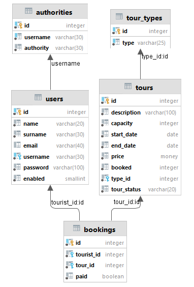

# SpringTours

Java course project

Идея приложения состоит в следующем:
Менеджер турфирмы наполняет сайт предложениями различных экскурсионных туров (впоследствии, если времени хватит, через какое-нибудь REST API), 
Tурист выбирает и регистрируется на выбранный тур.
К приложению поддерживается доступ как через REST API, так и через браузер с представлением в JSP.
Имеются следующие роли (каждая последующая расширяет функционал предыдущей):
- TOURIST: может просматривать имеющиеся туры, регистрироваться на них и отменять регистрацию
- MANAGER: может просматривать список туристов, блокировать и разблокировать их доступ, добавлять и удалять туры и их типы, 
менять статус платежа
- ADMIN: может давать права MANAGER'а работникам турфирмы
Само приложение отслеживает количество заявок на каждый тур, закрывает доступ к регистрации на тур при достижении предельного 
количества заявок или наступления даты тура, сохраняет записи о турах и бронированиях в базе данных.

**Инструкция к применению:**
1) Создать базу данных согласно скриптов в папке ресурсов sql или глядя на картинку выше
2) Отредактивровать application.yml, вставив свои данные
3) Добавить в таблицу authorities строку username = "admin", authority = "ROLE_ADMIN"
4) Добавить в таблицу users строку name = "Ivan", surname = "Ivanov", email = "ivanov@mail.ru",
username = "admin", password = "{bcrypt}$2a$12$7Thn9kamCgT1AfnAJQh4F.h9v52dPoID6qe37u7rDHu96feNbhOAm",
(это зашифрованный пароль "admin"), enabled = "1". Таким образом появится пользователь Иван Иванов, 
обладающий правами админа
5) Добавить в таблицу tour_types пару типов туров. Например, "пляжный отдых" или "mountain bike tour"
6) Добавить в конфигурацию запуска "внешний" Tomcat (дополнительно к уже встроенному серверу)
7) Запустить внутренний SpringTourApplication и работать через Postman с REST API,  
используя адреса, начинающиеся с "localhost:8080/api". Swagger-ui покажет эндпоитны для соответствующих
rest запросов. REST контроллеры работают без security
8) Альтернативно п.7 можно запустить внешний Tomcat и работать через браузер. В этом случае работает 
security и для входа в приложение нужно или заполнить форму и подписаться на сервис в статусе TOURIST,
имея возможность только выбора тура или отказа от него, или сразу зайти в систему 
под username "admin" и password "admin" (они были ранее введены для Ивана Иванова непосредственно 
в базу). У админа, менеджера и простого туриста разная видимость страниц и даже элементов страниц
